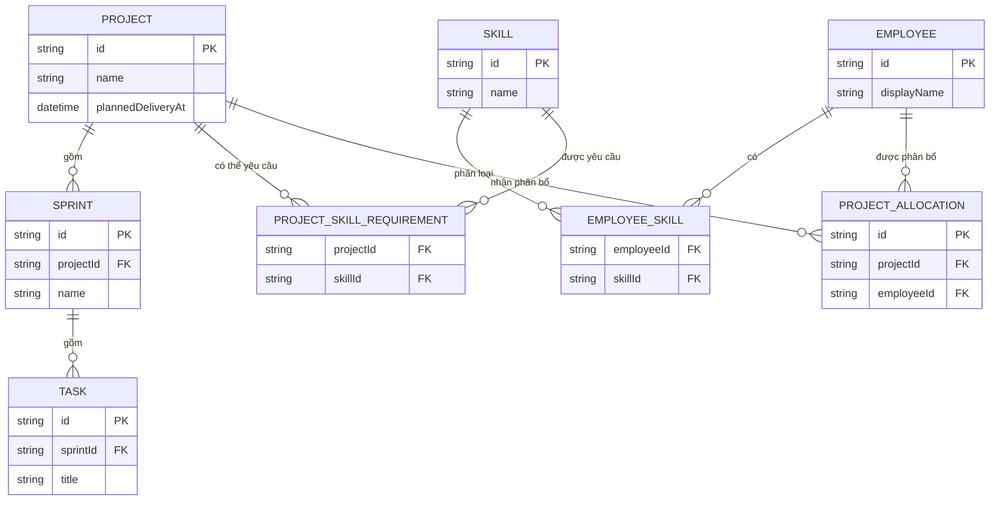
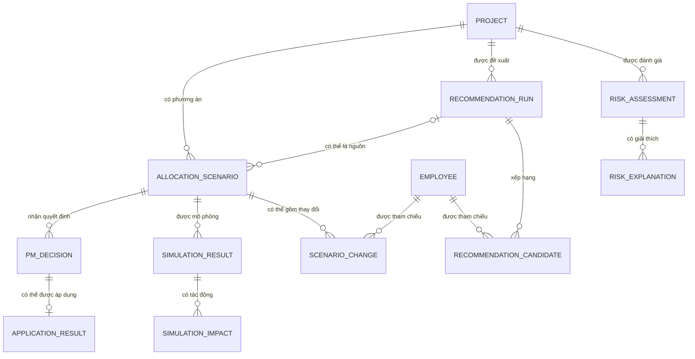

# Thiết kế dữ liệu và cơ sở dữ liệu RMS-AI MVP

## 1. Mục tiêu và phạm vi

Tài liệu này đề xuất mô hình dữ liệu tối thiểu để nhóm có thể chuẩn bị phần nền
tảng của Milestone 4 cho luồng:

```text
Dự án
-> Đánh giá và giải thích rủi ro
-> Đề xuất nhân sự
-> Phương án phân bổ
-> Mô phỏng và tác động dự kiến
-> Quyết định của PM
-> Áp dụng có điều kiện
```

Đây là thiết kế để con người rà soát, chưa phải lược đồ đã triển khai. Tài liệu
không tạo tệp chuyển đổi lược đồ, không chọn kiểu cột vật lý cuối cùng, không
định nghĩa DTO, không cài ORM/trình điều khiển và không bổ sung quy tắc nghiệp
vụ chưa có căn cứ.

Nguyên tắc cốt lõi: AI hỗ trợ, PM quyết định.

## 2. Nguồn và thứ tự thẩm quyền

Nguồn yêu cầu nghiệp vụ theo thứ tự ưu tiên:

1. `PRD.md`.
2. `user-stories.md`.
3. `acceptance-criteria.md`.

Tài liệu nền kỹ thuật và dữ liệu:

- `mvp-data-contract.md`.
- `system-architecture.md`.
- `initial-api-contracts.md`.

Nguồn thiết kế hỗ trợ:

- `pm-risk-ui-design.md`.
- `resource-recommendation-ui-design.md`.
- `chapter-04-ai-for-product-design/docs/what-if-simulation-ui-design.md`.

Nguồn trạng thái kho mã nguồn:

- `AGENTS.md`, `README.md`, `.local/KHANH_CODEX_PLAN.md`.
- `backend/package.json`, `backend/src/app.module.ts`.
- `ai-service/requirements.txt`, `ai-service/main.py`.
- Mã nguồn bản mẫu trong `frontend/src/`.

Thiết kế UI và dữ liệu mẫu chỉ cung cấp ngữ cảnh trình bày. Chúng không xác nhận
trường vận hành, thực thể cơ sở dữ liệu hoặc quy tắc nghiệp vụ.

## 3. Quy ước trạng thái

| Trạng thái | Ý nghĩa |
| --- | --- |
| YÊU CẦU ĐÃ XÁC NHẬN | Có căn cứ trực tiếp từ PRD, câu chuyện người dùng hoặc tiêu chí chấp nhận. |
| ĐỀ XUẤT KỸ THUẬT | Cấu trúc dữ liệu hợp lý cho MVP nhưng cần con người phê duyệt trước khi triển khai. |
| TBD | Chưa đủ căn cứ để chốt trường, quy tắc, công thức, lưu trữ hoặc hành vi. |
| CHỈ DÙNG BẢN MẪU | Chỉ tồn tại trong dữ liệu minh họa; không được đưa vào lược đồ vận hành theo mặc định. |
| DẪN XUẤT | Có thể tính từ dữ liệu khác; công thức vẫn là TBD nếu yêu cầu chưa xác nhận. |

Tên trường logic trong tài liệu dùng `camelCase` để dễ đối chiếu với API. Chúng
không xác nhận tên cột, kiểu dữ liệu hoặc quy ước đặt tên vật lý trong MySQL.

## 4. Trạng thái kho mã nguồn hiện tại

| Khu vực | Trạng thái đã kiểm tra | Hệ quả cho thiết kế |
| --- | --- | --- |
| Backend | NestJS 12 và TypeScript; `AppModule` chưa có mô-đun nghiệp vụ; chỉ có `GET /health` | Chưa có entity, repository hoặc ranh giới lưu trữ để kế thừa |
| Phụ thuộc Backend | Không có ORM, trình điều khiển MySQL hoặc thư viện chuyển đổi lược đồ | Không được mô tả phương án công nghệ là đã chọn |
| Cơ sở dữ liệu | MySQL là định hướng trong `AGENTS.md`; chưa có cấu hình hoặc kết nối | ERD là đề xuất kỹ thuật, chưa phải lược đồ hiện hữu |
| Frontend | React/Vite dùng dữ liệu mẫu cho rủi ro, ứng viên và quyết định cục bộ | Không dùng `project-a-mock`, `candidateId` hoặc kiểu trình bày làm khóa vận hành |
| Dịch vụ AI | FastAPI chỉ có `GET /health` | Chưa có dữ liệu mô hình, đầu vào hoặc đầu ra vận hành để ánh xạ vật lý |
| Xác thực/RBAC | Chưa có | Không tạo bảng người dùng, vai trò hoặc quyền trong lượt này |

## 5. Nguyên tắc thiết kế dữ liệu

- Chỉ thiết kế dữ liệu cần cho luồng quyết định MVP, không mở rộng thành hệ
  thống HR hoặc quản lý dự án đầy đủ.
- Tách dữ liệu nền vận hành khỏi kết quả AI và lịch sử hỗ trợ quyết định.
- Tách ứng viên đề xuất khỏi phương án phân bổ.
- Tách mô phỏng khỏi phân bổ thật.
- Tách quyết định của PM khỏi kết quả áp dụng.
- Không mặc định mọi kết quả AI phải được lưu trữ lâu dài.
- Không đưa điểm số, ngưỡng, trọng số, công thức, chỉ số tác động hoặc thời hạn
  lưu vào lược đồ khi chúng còn TBD.
- Khóa ngoại và định danh kỹ thuật không biến một quan hệ đề xuất thành yêu cầu
  nghiệp vụ đã xác nhận.
- Bản mẫu Frontend không phải nguồn cho trường vận hành.

## 6. Danh mục thực thể và khái niệm

| Khái niệm | Cần khi chạy | Lưu trữ đề xuất | Trạng thái lưu trữ | Quan hệ chính | Chủ sở hữu / ca sử dụng |
| --- | --- | --- | --- | --- | --- |
| Dự án (`Project`) | Có | Có, cho dữ liệu nền MVP | ĐỀ XUẤT KỸ THUẬT | Gốc của Sprint, Task, yêu cầu kỹ năng, phân bổ và luồng quyết định | Nền tảng dự án; US-01 đến US-04 |
| Chu kỳ phát triển (`Sprint`) | Có thể | Có nếu được chọn làm ngữ cảnh rủi ro | ĐỀ XUẤT KỸ THUẬT; mức bắt buộc TBD | Thuộc một dự án; có nhiều công việc | Nền tảng Project/Sprint/Task |
| Công việc (`Task`) | Có thể | Có nếu được chọn làm ngữ cảnh rủi ro | ĐỀ XUẤT KỸ THUẬT; trường tiến độ TBD | Thuộc một Sprint | Đầu vào rủi ro tiềm năng |
| Nhân sự (`Employee`) | Có | Có, cho nhận diện nguồn lực | ĐỀ XUẤT KỸ THUẬT | Có kỹ năng và phân bổ | Nền tảng Employee/Skill/Allocation |
| Kỹ năng (`Skill`) | Có thể | Có nếu nhóm duyệt là dữ liệu hỗ trợ MVP | ĐỀ XUẤT KỸ THUẬT | Liên kết nhân sự và yêu cầu dự án | Đề xuất nhân sự |
| Kỹ năng của nhân sự (`EmployeeSkill`) | Có thể | Có nếu kỹ năng được dùng | ĐỀ XUẤT KỸ THUẬT; cấp độ TBD | Nối Employee và Skill | Đề xuất nhân sự |
| Yêu cầu kỹ năng dự án (`ProjectSkillRequirement`) | Có thể | Có nếu nhu cầu kỹ năng được chốt | TBD về ngữ nghĩa | Nối Project và Skill | Thiếu hụt kỹ năng / đề xuất |
| Phân bổ dự án (`ProjectAllocation`) | Có ở mức khái niệm; vận hành còn TBD | Chỉ sau khi semantics phân bổ được chốt | BỊ CHẶN cho persistence vận hành | Biểu diễn quan hệ Employee <-> Project; chưa phải bảng production sẵn sàng triển khai | Phân bổ thật / mốc so sánh mô phỏng |
| Đánh giá rủi ro (`RiskAssessment`) | Có | Không mặc định; có thể lưu lịch sử | TBD | Thuộc đúng Project | US-01 |
| Giải thích rủi ro (`RiskExplanation`) | Có | Theo RiskAssessment nếu lịch sử được duyệt | TBD | Thuộc đúng RiskAssessment | US-01 |
| Lần đề xuất (`RecommendationRun`) | Có | Không mặc định; có thể lưu để truy vết | TBD | Thuộc Project | US-02 |
| Ứng viên đề xuất (`RecommendationCandidate`) | Có | Theo RecommendationRun nếu lịch sử được duyệt | TBD | Tham chiếu Employee; không phải AllocationScenario | US-02 |
| Phương án phân bổ (`AllocationScenario`) | Có | Không mặc định; có thể lưu nếu cần quyết định/truy vết | TBD | Thuộc Project; có các thay đổi giả định | US-03, US-04 |
| Thay đổi trong phương án (`ScenarioChange`) | Có | Theo AllocationScenario nếu phương án được lưu | TBD | Tham chiếu Employee và Project; không phải phân bổ thật | US-03 |
| Kết quả mô phỏng (`SimulationResult`) | Có | Không mặc định | TBD | Thuộc đúng AllocationScenario | US-03 |
| Tác động mô phỏng (`SimulationImpact`) | Có | Theo SimulationResult nếu lịch sử được duyệt | TBD | Thuộc đúng SimulationResult | US-03 |
| Quyết định của PM (`PMDecision`) | Có | Có thể lưu để truy vết, nhưng chưa được yêu cầu xác nhận | TBD | Thuộc đúng AllocationScenario | US-04 |
| Kết quả áp dụng (`ApplicationResult`) | Chỉ khi áp dụng được triển khai | Không mặc định | TBD; việc áp dụng đang bị chặn | Thuộc PMDecision; tách khỏi quyết định | US-04 / áp dụng có điều kiện |

Không phải mọi khái niệm trong bảng đều phải trở thành bảng. Các khái niệm có trạng
thái TBD chỉ được vật lý hóa sau khi mục đích lưu trữ được phê duyệt.

Quan hệ khái niệm Employee <-> Project đã có mô hình, nhưng không đồng nghĩa
`ProjectAllocation` đã sẵn sàng thành bảng production. Không tạo một phân bổ thật
chỉ từ `id`, `projectId` và `employeeId` khi lượng, đơn vị và phạm vi phân bổ chưa
được xác định.

## 7. ERD nền tảng dữ liệu

Sơ đồ này mô tả quan hệ đề xuất cho dữ liệu nền Milestone 4. `PROJECT_ALLOCATION`
chỉ là khái niệm định hướng cho quan hệ Employee <-> Project, không phải bảng
production đã sẵn sàng triển khai. Sơ đồ không xác nhận trường AI, công thức phân
bổ hoặc quy tắc nhân sự chờ phân bổ.



Các trường trong ERD là trường logic tối thiểu để đọc quan hệ. Trạng thái chi
tiết nằm ở các mục tiếp theo; sơ đồ không làm cho chúng trở thành yêu cầu hoặc
thành cấu trúc persistence production đã được duyệt.

## 8. Dự án, Sprint và Task

### 8.1. Dự án

| Trường logic | Mục đích | Phân loại | Có thể triển khai ngay sau khi duyệt công nghệ |
| --- | --- | --- | --- |
| `id` | Giữ đúng ngữ cảnh dự án và hỗ trợ `projectId` trong API | ĐỀ XUẤT KỸ THUẬT | Có |
| `name` | Giúp con người phân biệt dự án | ĐỀ XUẤT KỸ THUẬT; tên hiển thị cụ thể chưa được yêu cầu chốt | Có |
| `plannedDeliveryAt` | Biểu diễn kế hoạch/thời hạn bàn giao mà rủi ro đang nói tới | ĐỀ XUẤT KỸ THUẬT dựa trên khái niệm đã xác nhận | Có, sau khi nhóm duyệt cách biểu diễn thời gian |
| `statusCode` | Trạng thái dự án | TBD về hệ phân loại và mức bắt buộc | Không |
| `progressValue` | Tiến độ dự án | TBD về đơn vị, nguồn và công thức | Không |
| `teamReference` | Ngữ cảnh đội ngũ | TBD | Không |

Kiểm tra hợp lệ tối thiểu được đề xuất:

- `id` không rỗng và duy nhất.
- `name` không rỗng nếu nhóm duyệt đây là nhãn vận hành.
- Nếu lưu các mốc thời gian, thứ tự thời gian phải hợp lệ. Đây là ràng buộc toàn
  vẹn kỹ thuật, không phải quy tắc tính rủi ro.

### 8.2. Sprint

| Trường logic | Mục đích | Phân loại | Mức sẵn sàng |
| --- | --- | --- | --- |
| `id` | Định danh kỹ thuật | ĐỀ XUẤT KỸ THUẬT | SẴN SÀNG |
| `projectId` | Bảo đảm Sprint thuộc đúng dự án | ĐỀ XUẤT KỸ THUẬT | SẴN SÀNG |
| `name` | Nhãn tối thiểu cho Sprint | ĐỀ XUẤT KỸ THUẬT | SẴN SÀNG |
| `startsAt`, `endsAt` | Khoảng thời gian kế hoạch | TBD về mức bắt buộc | Chưa nên bắt buộc |
| `statusCode`, `progressValue` | Ngữ cảnh rủi ro tiềm năng | TBD | Không triển khai ngữ nghĩa |

Quan hệ đề xuất: một Project có không hoặc nhiều Sprint; mỗi Sprint thuộc đúng
một Project. Yêu cầu chưa xác nhận dự án bắt buộc phải có Sprint.

### 8.3. Task

| Trường logic | Mục đích | Phân loại | Mức sẵn sàng |
| --- | --- | --- | --- |
| `id` | Định danh kỹ thuật | ĐỀ XUẤT KỸ THUẬT | SẴN SÀNG |
| `sprintId` | Giữ quan hệ Project -> Sprint -> Task | ĐỀ XUẤT KỸ THUẬT | SẴN SÀNG |
| `title` | Nhãn tối thiểu của công việc | ĐỀ XUẤT KỸ THUẬT | SẴN SÀNG |
| `plannedDueAt`, `completedAt` | Tín hiệu tiến độ tiềm năng | TBD | Không bắt buộc |
| `statusCode` | Trạng thái công việc | TBD về hệ phân loại | Không |
| `effortEstimate`, `progressValue` | Tín hiệu rủi ro tiềm năng | TBD về đơn vị/công thức | Không |

Thiết kế không thêm backlog, phụ thuộc công việc, bình luận, người theo dõi,
nhật ký thay đổi hoặc luồng công việc kiểu Jira.

### 8.4. Kết luận mức sẵn sàng cho nền tảng dự án

Sau khi branch này merge, Hiền có thể triển khai nền tảng gồm định danh, tên và
quan hệ Project -> Sprint -> Task. Trường tiến độ, trạng thái, công sức và đầu
vào rủi ro chưa nên được dùng làm đặc trưng AI hoặc điều kiện nghiệp vụ cho tới
khi TBD-01 và TBD-02 được chốt.

## 9. Nhân sự, kỹ năng và phân bổ

### 9.1. Employee

| Trường logic | Mục đích | Phân loại |
| --- | --- | --- |
| `id` | Tham chiếu nguồn lực ổn định | ĐỀ XUẤT KỸ THUẬT |
| `displayName` | Nhãn giúp PM phân biệt ứng viên | ĐỀ XUẤT KỸ THUẬT; trường hiển thị vẫn cần duyệt |
| `authUserReference` | Liên kết tới danh tính đăng nhập | TBD; không tạo trong lượt này |
| Các trường HR khác | Hồ sơ nhân sự rộng | Ngoài phạm vi MVP nếu không có căn cứ mới |

### 9.2. Skill và EmployeeSkill

| Trường logic | Mục đích | Phân loại |
| --- | --- | --- |
| `Skill.id`, `Skill.name` | Danh mục kỹ năng tối thiểu | ĐỀ XUẤT KỸ THUẬT |
| `EmployeeSkill.employeeId`, `skillId` | Ghi nhận quan hệ nhân sự-kỹ năng | ĐỀ XUẤT KỸ THUẬT |
| `EmployeeSkill.level` | Mức kỹ năng | TBD về thang đo và nguồn xác nhận |
| `EmployeeSkill.evidence` | Bằng chứng kỹ năng | TBD; không cần cho nền tảng đầu tiên |
| `EmployeeSkill.assessedAt` | Độ mới của đánh giá | TBD |

Đề xuất toàn vẹn kỹ thuật: một cặp `employeeId` + `skillId` không lặp. Điều này
không định nghĩa mức kỹ năng hoặc tiêu chí phù hợp.

### 9.3. ProjectSkillRequirement

Khái niệm này giúp biểu diễn thiếu hụt kỹ năng nhưng yêu cầu chỉ xác nhận mục
tiêu bù thiếu hụt ở mức sản phẩm. Các trường `requiredLevel`, `requiredCount`,
`validFrom`, `validTo` và mức bắt buộc đều TBD. Chỉ nên triển khai bảng này sau
khi nhóm duyệt mô hình yêu cầu kỹ năng tối thiểu.

### 9.4. ProjectAllocation

| Trường logic | Mục đích | Phân loại |
| --- | --- | --- |
| `id`, `projectId`, `employeeId` | Nhận diện khái niệm quan hệ Employee <-> Project | ĐỀ XUẤT KỸ THUẬT ở mức mô hình; không đủ để tạo phân bổ thật |
| `startsAt`, `endsAt` | Khoảng hiệu lực | TBD về mức bắt buộc và biên thời gian |
| `allocationAmount` | Lượng phân bổ | TBD về đơn vị và miền giá trị |
| `allocationUnit` | Phần trăm, giờ hoặc đơn vị khác | TBD; không tự chọn |
| `roleReference` | Vai trò trong dự án | TBD |
| `statusCode` | Trạng thái phân bổ | TBD |

Quan hệ Employee <-> Project **SẴN SÀNG** ở mức mô hình khái niệm. Tuy nhiên,
`ProjectAllocation` vận hành và persistence production **BỊ CHẶN**. Không thể
chốt một phân bổ thật chỉ từ ba khóa tham chiếu vì `allocationAmount`,
`allocationUnit`, khoảng hiệu lực, giới hạn tổng, chồng lấn, năng lực, mức độ
sẵn sàng, mức sử dụng và quy tắc nhân sự chờ phân bổ vẫn TBD.

## 10. ERD khái niệm cho kết quả AI và quyết định

Sơ đồ này chỉ áp dụng nếu nhóm duyệt lưu lịch sử tương ứng. Quan hệ khi chạy vẫn
cần tồn tại về mặt logic ngay cả khi các đối tượng chỉ sống trong bộ nhớ hoặc phản
hồi API.



### 10.1. RiskAssessment và RiskExplanation

| Trường logic | Phân loại |
| --- | --- |
| `RiskAssessment.id`, `projectId` | ĐỀ XUẤT KỸ THUẬT nếu lưu lịch sử |
| `assessmentOutcome` | Kết quả khái niệm đã xác nhận; cách biểu diễn TBD |
| `score`, `probability`, `level`, `threshold` | TBD; không đưa vào lược đồ bắt buộc |
| `assessedAt`, `modelVersion`, `freshnessState` | TBD |
| `RiskExplanation.assessmentId` | ĐỀ XUẤT KỸ THUẬT nếu lưu giải thích |
| Nội dung, thứ tự, đóng góp, quan hệ nhân quả | TBD |

### 10.2. RecommendationRun và RecommendationCandidate

| Trường logic | Phân loại |
| --- | --- |
| `RecommendationRun.id`, `projectId` | ĐỀ XUẤT KỸ THUẬT nếu lưu lịch sử |
| `outcome` | Kết quả có ứng viên / không có ứng viên / không khả dụng là ranh giới hợp đồng đề xuất |
| `RecommendationCandidate.recommendationRunId` | ĐỀ XUẤT KỸ THUẬT |
| `employeeId` | ĐỀ XUẤT KỸ THUẬT cho định danh ứng viên; cần phối hợp API |
| `rankOrder` | ĐỀ XUẤT KỸ THUẬT để giữ thứ hạng đã xác nhận |
| `suitabilityExplanation` | Kết quả đã xác nhận; cấu trúc TBD |
| `matchingScore`, `confidence`, trọng số | TBD; không thêm điểm ghép nối hoặc độ tin cậy |

`RecommendationCandidate` là một mục trong kết quả đề xuất, không phải
`ProjectAllocation`, `AllocationScenario` hoặc `ScenarioChange`.

### 10.3. AllocationScenario và ScenarioChange

| Trường logic | Phân loại |
| --- | --- |
| `AllocationScenario.id`, `projectId` | ĐỀ XUẤT KỸ THUẬT nếu cần tham chiếu ổn định |
| `sourceRecommendationId` | TBD; nguồn đề xuất không bắt buộc |
| `ScenarioChange.scenarioId`, `employeeId` | ĐỀ XUẤT KỸ THUẬT ở mức quan hệ |
| `targetProjectId` | ĐỀ XUẤT KỸ THUẬT nếu phương án thay đổi phân bổ tới dự án |
| `allocationAmount`, `allocationUnit`, `startsAt`, `endsAt` | TBD |
| Số lượng thay đổi trong phương án | TBD; ERD cho phép 0..n để không áp đặt số lượng tối thiểu |

`ScenarioChange` chỉ biểu diễn thay đổi giả định. Nó không được ghi đè hoặc dùng
chung hàng dữ liệu với `ProjectAllocation`.

### 10.4. SimulationResult và SimulationImpact

| Trường logic | Phân loại |
| --- | --- |
| `SimulationResult.id`, `scenarioId` | ĐỀ XUẤT KỸ THUẬT nếu lưu lịch sử |
| `outcome` | Thành công/không khả dụng ở mức hợp đồng đề xuất; vòng đời chi tiết TBD |
| `SimulationImpact.simulationResultId` | ĐỀ XUẤT KỸ THUẬT nếu lưu tác động |
| `dimension`, `baseline`, `expectedValue`, `delta`, `scale` | TBD |
| `explanation`, `calculatedAt`, độ mới | TBD |

Kết quả phải liên kết với đúng phương án đã mô phỏng. Không có trường tác động số
nào được xác nhận ở thời điểm hiện tại.

### 10.5. PMDecision và ApplicationResult

| Trường logic | Phân loại |
| --- | --- |
| `PMDecision.id`, `scenarioId` | ĐỀ XUẤT KỸ THUẬT nếu lưu quyết định |
| `decision` | YÊU CẦU ĐÃ XÁC NHẬN: Chấp nhận hoặc Từ chối |
| `actorReference`, `decidedAt`, `rejectionReason` | TBD |
| `ApplicationResult.id`, `decisionId` | ĐỀ XUẤT KỸ THUẬT nếu việc áp dụng được triển khai |
| `applicationOutcome` | Cần phân biệt với quyết định; trạng thái cụ thể TBD |
| `appliedAt`, lỗi, phục hồi, thử lại | TBD |

`PMDecision` không được dùng làm bằng chứng áp dụng thành công. `ApplicationResult`
không được tạo cho nhánh Từ chối như thể một thay đổi đã được áp dụng.

## 11. Ma trận lưu trữ lâu dài

| Nhóm dữ liệu | Cần khi chạy | Lợi ích khi lưu | Yêu cầu bắt buộc lưu | Đề xuất hiện tại |
| --- | --- | --- | --- | --- |
| `Project` | Có | Ngữ cảnh chung cho toàn bộ luồng | Không nêu trực tiếp | Lưu như dữ liệu nền MVP sau phê duyệt |
| `Sprint`/`Task` | Có thể | Tín hiệu tiến độ và cấu trúc công việc | Không; mức cần thiết TBD | Chỉ lưu nền tảng tối thiểu nếu được chọn làm đầu vào |
| `Employee`/`Skill` | Có thể | Nhận diện ứng viên và dữ liệu hỗ trợ | Không nêu trường bắt buộc | Lưu tối thiểu sau khi duyệt mô hình kỹ năng |
| Quan hệ Employee <-> Project | Có ở mức khái niệm | Xác định ranh giới dữ liệu | Không yêu cầu một bảng riêng | SẴN SÀNG ở mức mô hình; không ghi phân bổ thật |
| `ProjectAllocation` vận hành | Có khi chức năng phân bổ thật được triển khai | Mốc phân bổ thật và nền cho mô phỏng | Hành vi thật cần một nguồn trạng thái; lược đồ chưa được xác nhận | BỊ CHẶN tới khi chốt semantics phân bổ tối thiểu |
| `RiskAssessment`/`RiskExplanation` | Có khi trả kết quả | Lịch sử, so sánh, truy vết | Không | Không mặc định lưu; TBD |
| `RecommendationRun`/`RecommendationCandidate` | Có khi trả kết quả | Truy vết đề xuất PM đã xem | Không | Không mặc định lưu; TBD |
| `AllocationScenario` | Có cho mô phỏng/quyết định | Giữ đúng phương án và liên kết | Không xác nhận lưu | Có thể lưu nếu `PMDecision` cần tham chiếu bền vững; TBD |
| `SimulationResult`/`SimulationImpact` | Có khi mô phỏng thành công | Chứng minh tác động gắn với phương án | Không | Không mặc định lưu; TBD |
| `PMDecision` | Có | Kiểm toán quyền quyết định của PM | Không xác nhận lưu | Đề xuất xem xét ưu tiên, vẫn cần phê duyệt |
| `ApplicationResult` | Chỉ khi có áp dụng | Phân biệt quyết định và kết quả thật | Không | BỊ CHẶN cùng hợp đồng áp dụng |

Thời hạn lưu, xóa, lưu trữ lạnh, phiên bản dữ liệu và TTL đều TBD.

## 12. Đề xuất lưu lịch sử

| Loại lịch sử | Lợi ích | Bằng chứng yêu cầu | Cần cho MVP hiện tại | Trạng thái |
| --- | --- | --- | --- | --- |
| Rủi ro | Xem diễn biến và giải thích kết quả cũ | Không có yêu cầu lịch sử | Không được xác nhận | TBD |
| Đề xuất nhân sự | Biết PM đã xem ứng viên nào và thứ hạng nào | Không có yêu cầu lịch sử | Không được xác nhận | TBD |
| Mô phỏng/tác động | Liên kết quyết định với kết quả đã xem | Kết quả phải thuộc đúng phương án; lưu trữ lâu dài không được yêu cầu | Có ích nhưng chưa bắt buộc | TBD |
| Quyết định | Kiểm toán Chấp nhận/Từ chối rõ ràng | PM là người quyết định; lưu quyết định chưa được yêu cầu | Có ích cho truy vết | ĐỀ XUẤT KỸ THUẬT cần phê duyệt |
| Áp dụng | Phân biệt thành công/thất bại và tránh báo sai | Không được báo thành công khi thất bại | Chỉ khi chức năng áp dụng tồn tại | BỊ CHẶN; chi tiết TBD |

Không triển khai bảng lịch sử chỉ vì ERD có thể biểu diễn chúng. Nếu nhóm duyệt
lưu lịch sử, phải chốt mục đích, dữ liệu tối thiểu, độ mới và thời hạn lưu trước.

## 13. Bảo mật và RBAC ở mức dữ liệu

- YÊU CẦU ĐÃ XÁC NHẬN: PM là người quyết định cuối cùng.
- Chưa có xác thực, RBAC, bảng người dùng hoặc ma trận vai trò trong kho mã nguồn.
- Quyền xem dự án và quyền đưa ra quyết định cho từng dự án đều TBD.
- Không tạo `User`, `Role`, `Permission` hoặc bảng nối RBAC trong thiết kế MVP
  hiện tại.
- `actorReference` của PMDecision có thể cần cho kiểm toán, nhưng nguồn định
  danh, khóa ngoại và thời hạn lưu đều TBD.
- Trước khi có mô hình danh tính được duyệt, không dùng tên hiển thị làm định
  danh bảo mật và không giả định một Employee cũng là tài khoản đăng nhập.
- Bảo vệ kết nối Backend -> AI và dữ liệu nhạy cảm nằm ngoài ERD này, vẫn cần
  thiết kế bảo mật riêng.

## 14. Quyết định công nghệ persistence trước Milestone 4

### 14.1. Trạng thái hiện tại

- Nhóm đã phê duyệt định hướng kỹ thuật: MySQL + TypeORM + `@nestjs/typeorm` +
  `mysql2`.
- Backend dùng NestJS 12 và TypeScript.
- Không có ORM, trình điều khiển MySQL, cấu hình kết nối hoặc công cụ chuyển đổi lược đồ.
- Nhiệm vụ này không cài gói phụ thuộc và không tạo tệp chuyển đổi lược đồ.

### 14.2. Quyết định được nhóm phê duyệt

| Thành phần | Quyết định | Trạng thái |
| --- | --- | --- |
| Cơ sở dữ liệu | MySQL | ĐỊNH HƯỚNG KỸ THUẬT ĐÃ ĐƯỢC NHÓM PHÊ DUYỆT |
| ORM | TypeORM | ĐỊNH HƯỚNG KỸ THUẬT ĐÃ ĐƯỢC NHÓM PHÊ DUYỆT |
| Tích hợp NestJS | `@nestjs/typeorm` | ĐỊNH HƯỚNG KỸ THUẬT ĐÃ ĐƯỢC NHÓM PHÊ DUYỆT |
| Trình điều khiển MySQL | `mysql2` | ĐỊNH HƯỚNG KỸ THUẬT ĐÃ ĐƯỢC NHÓM PHÊ DUYỆT |
| Phiên bản package chính xác | Chưa chốt; phải kiểm tra package manager, phiên bản NestJS và tính tương thích khi bắt đầu implementation | TBD |

Nguồn kỹ thuật tham khảo:

- [Tổng quan cơ sở dữ liệu của NestJS](https://docs.nestjs.com/data/overview).
- [Tích hợp TypeORM của NestJS](https://docs.nestjs.com/techniques/database).
- [TypeORM với MySQL/MariaDB](https://typeorm.io/docs/drivers/mysql/).

### 14.3. Guardrail đã được duyệt

- Cấu hình kết nối phải đi qua biến môi trường; không hard-code thông tin xác thực.
- Không dùng `synchronize: true` như chiến lược quản lý lược đồ production.
- Khi bắt đầu persistence implementation, thay đổi lược đồ phải đi qua migration.
- Phiên bản package chính xác vẫn TBD cho tới khi kiểm tra package manager,
  NestJS hiện tại và ma trận tương thích.
- Lượt review này không cài package và không tạo migration.

## 15. Ánh xạ với hợp đồng API ban đầu

| Hợp đồng API / trường | Hỗ trợ từ mô hình dữ liệu | Điểm cần phối hợp với API |
| --- | --- | --- |
| `projectId` | Có thể ánh xạ tới `Project.id` | Định dạng và nguồn cấp ID vẫn là ĐỀ XUẤT KỸ THUẬT |
| `projectContext`, `projectReference` | Project là gốc ngữ cảnh; Sprint/Task có thể bổ sung | Trường tối thiểu và bên chịu trách nhiệm lấy dữ liệu vẫn TBD |
| `riskAssessment`, `keyFactors` | Có khái niệm `RiskAssessment`/`RiskExplanation` | Cách biểu diễn, trường và lưu trữ lâu dài đều TBD |
| `candidateReference` | Có thể tham chiếu `Employee.id` hoặc một mục `RecommendationCandidate` | Cần quyết định tham chiếu trỏ tới nguồn lực hay mục trong một lần đề xuất |
| `candidates`, `rankedCandidates` | `RecommendationRun`/`RecommendationCandidate` giữ thứ tự và giải thích nếu được lưu | API không yêu cầu lưu trữ lâu dài; điểm và độ tin cậy vẫn TBD |
| `scenarioReference` | Có thể ánh xạ `AllocationScenario.id` nếu phương án được lưu | Nếu chỉ tồn tại khi chạy, cần liên kết tạm; API không được dùng ID ứng viên thay ID phương án |
| `proposedAllocationChange`, `allocationScenario` | `ScenarioChange` là khái niệm tương ứng | Trường, đơn vị phân bổ, thời gian và số nguồn lực vẫn TBD |
| `scenarioCorrelation` | Quan hệ `SimulationResult` -> `AllocationScenario` hỗ trợ | Cách biểu diễn tham chiếu TBD |
| `expectedImpact` | `SimulationImpact` là khái niệm tương ứng | Khía cạnh, mốc so sánh, thang đo và công thức TBD |
| `decision`, `decisionOutcome` | `PMDecision` tách riêng và tham chiếu phương án | Chủ thể, dấu thời gian, lặp và lưu trữ lâu dài TBD |
| Kết quả áp dụng | `ApplicationResult` tách khỏi `PMDecision` | API áp dụng chưa được đề xuất và vẫn bị chặn |

### 15.1. Trường API chưa được mô hình hỗ trợ đầy đủ

- `recommendationContext`, `staffingNeed`, `constraints`: chưa có lược đồ vì nhu
  cầu nhân sự, vai trò, kỹ năng bắt buộc và ràng buộc còn TBD.
- `riskAssessment`, `expectedImpact`: chưa thể chọn cột vật lý vì cách biểu diễn
  chưa được chốt.
- Các trạng thái `available`, `unavailable`, `candidates_available` và
  `no_suitable_candidate` là vỏ hợp đồng đề xuất; chưa phải enum cơ sở dữ liệu đã
  được phê duyệt.

### 15.2. Trường nội bộ mô hình dữ liệu mà API không cần công khai

- Khóa chính nội bộ, khóa ngoại và siêu dữ liệu toàn vẹn.
- Quan hệ EmployeeSkill và ProjectSkillRequirement.
- Trường phục vụ chuyển đổi lược đồ hoặc kiểm toán sau này nếu được duyệt.

Các trường nội bộ này không nên tự động được đưa vào DTO hoặc phản hồi API.

## 16. TBD và điểm chặn

### Dữ liệu nền

- Định dạng ID và quy tắc hiển thị của Project/Employee/Skill.
- Trường tối thiểu và nguồn dữ liệu cho Project/Sprint/Task.
- Hệ phân loại trạng thái, tiến độ, công sức và mốc thời gian.
- Mô hình yêu cầu kỹ năng và thang đo mức kỹ năng.
- Đơn vị phân bổ, khoảng hiệu lực, quy tắc chồng lấn và giới hạn tổng.
- Công thức mức độ sẵn sàng, mức sử dụng và trạng thái nhân sự chờ phân bổ.

### AI và lịch sử

- Mục tiêu/nhãn rủi ro, đặc trưng, cách biểu diễn, ngưỡng và độ mới.
- Điều kiện ứng viên, công thức xếp hạng, điểm và độ tin cậy.
- Cấu trúc phương án và ánh xạ ứng viên sang phương án.
- Khía cạnh, mốc so sánh và cách biểu diễn tác động.
- Có lưu lịch sử rủi ro/đề xuất/mô phỏng/quyết định hay không; thời hạn lưu.

### Quyết định và áp dụng

- Danh tính chủ thể thực hiện, quyền dự án và RBAC.
- Điều kiện/thời điểm áp dụng, giao dịch, lỗi một phần, thử lại và khôi phục.
- Hành vi quyết định lặp và dữ liệu thay đổi sau mô phỏng.

### Công nghệ

- Phiên bản chính xác của TypeORM, `@nestjs/typeorm` và `mysql2`.
- Chi tiết cấu hình biến môi trường và migration khi implementation bắt đầu.

## 17. Mức sẵn sàng cho Milestone 4

| Khu vực | Mức sẵn sàng | Kết luận |
| --- | --- | --- |
| Nền tảng Project/Sprint/Task | SẴN SÀNG | Có thể triển khai field đủ căn cứ sau khi branch này merge; trạng thái, tiến độ, công sức và đặc trưng rủi ro vẫn TBD |
| Nền tảng Employee/Skill | SẴN SÀNG | Có thể bắt đầu sau khi nền tảng Project/Sprint/Task merge; không mở rộng hồ sơ HR |
| `EmployeeSkill` tối thiểu | SẴN SÀNG MỘT PHẦN | Có thể triển khai quan hệ; mức kỹ năng và bằng chứng vẫn TBD |
| Quan hệ Employee <-> Project | SẴN SÀNG | Đã có mô hình khái niệm; không đồng nghĩa có bảng phân bổ vận hành |
| `ProjectAllocation` vận hành | BỊ CHẶN | Lượng, đơn vị, thời gian, năng lực, chồng lấn và giới hạn tổng chưa chốt |
| Đầu vào/đầu ra rủi ro | BỊ CHẶN | Mục tiêu, đặc trưng tối thiểu và cách biểu diễn chưa chốt |
| Đề xuất nhân sự | SẴN SÀNG MỘT PHẦN | Kết quả khái niệm rõ; điều kiện phù hợp, lược đồ và xếp hạng còn TBD |
| Phương án/mô phỏng/tác động | SẴN SÀNG MỘT PHẦN | Bất biến rõ; cấu trúc và chỉ số còn TBD |
| PMDecision | SẴN SÀNG MỘT PHẦN | Chấp nhận/Từ chối rõ; chủ thể, lưu trữ lâu dài và hành vi lặp TBD |
| ApplicationResult | BỊ CHẶN | Điều kiện áp dụng và giao dịch chưa chốt |
| Lịch sử | BỊ CHẶN | Không có yêu cầu bắt buộc lưu |
| Công nghệ lưu trữ | SẴN SÀNG | MySQL + TypeORM + `@nestjs/typeorm` + `mysql2` đã được nhóm phê duyệt; phiên bản package chính xác vẫn TBD |

Kết luận: sau khi branch này merge, Hiền có thể bắt đầu nền tảng
Project/Sprint/Task với các field đủ căn cứ. Khánh có thể bắt đầu nền tảng
`Employee`/`Skill` sau khi nền tảng đó merge và có thể tạo quan hệ
`EmployeeSkill` tối thiểu mà không thêm mức kỹ năng. `ProjectAllocation` vận
hành, đặc trưng AI, quy tắc phân bổ, nhân sự chờ phân bổ/mức sử dụng, lưu lịch sử
và việc áp dụng thật vẫn chưa đủ căn cứ triển khai.

## 18. Checklist tự rà soát

- [x] Không biến dữ liệu mẫu thành lược đồ.
- [x] Không tạo điểm, ngưỡng hoặc mục tiêu rủi ro.
- [x] Không tạo công thức ghép nối, trọng số hoặc số lượng ứng viên.
- [x] Không tạo chỉ số tác động.
- [x] `RecommendationCandidate` tách khỏi `AllocationScenario`.
- [x] `PMDecision` tách khỏi `ApplicationResult`.
- [x] Không mặc định mọi kết quả AI phải được lưu.
- [x] Không mở rộng HR/Jira ngoài MVP.
- [x] Không cài ORM/trình điều khiển và không tạo tệp chuyển đổi lược đồ/mã nguồn.
- [x] Trường chưa có căn cứ vẫn là TBD.
- [x] MySQL + TypeORM + `@nestjs/typeorm` + `mysql2` đã được ghi là định hướng kỹ thuật được nhóm phê duyệt.
- [x] Phiên bản package chính xác vẫn TBD; không cài dependency hoặc tạo migration.
- [x] Quan hệ Employee <-> Project không bị nhầm với `ProjectAllocation` production sẵn sàng triển khai.
- [x] `ProjectAllocation` vận hành vẫn BỊ CHẶN; semantics phân bổ vẫn TBD.
- [x] Nêu rõ phần nền tảng Project/Sprint/Task có thể bắt đầu sau khi branch này merge.
