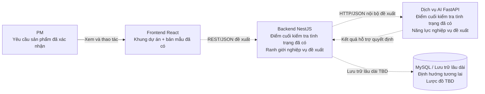

# Kiến trúc hệ thống mức cao RMS-AI

## 1. Mục tiêu và phạm vi

Tài liệu này mô tả kiến trúc mức cao phục vụ luồng MVP:

```text
Dự án
-> Đánh giá và giải thích rủi ro
-> Đề xuất nhân sự
-> Phương án phân bổ
-> Mô phỏng giả định và tác động dự kiến
-> Quyết định của PM
-> Áp dụng có điều kiện
```

Tài liệu chỉ thiết kế ranh giới thành phần và hợp đồng kỹ thuật ban đầu. Tài
liệu không xác nhận các thành phần nghiệp vụ đã được triển khai, không định
nghĩa lược đồ cơ sở dữ liệu, DTO vận hành, thuật toán AI, công thức xếp hạng,
công thức mô phỏng, cơ chế áp dụng, hạ tầng triển khai hoặc phân quyền.

Nguyên tắc cốt lõi: AI hỗ trợ, PM quyết định.

## 2. Nguồn tham chiếu và quy ước trạng thái

Nguồn yêu cầu sản phẩm theo thứ tự ưu tiên:

1. `PRD.md`.
2. `user-stories.md`.
3. `acceptance-criteria.md`.

Tài liệu nền về dữ liệu và ranh giới:

- `mvp-data-contract.md`.

Nguồn thiết kế hỗ trợ:

- `pm-risk-ui-design.md`.
- `resource-recommendation-ui-design.md`.
- `chapter-04-ai-for-product-design/docs/what-if-simulation-ui-design.md`.
- Bản mẫu hiện tại trong `frontend/src/`.

Nguồn định hướng kỹ thuật:

- `AGENTS.md`.
- `README.md`.
- `.local/HIEN_CODEX_PLAN.md`.
- Mã nguồn và cấu hình hiện có trong `frontend/`, `backend/`, `ai-service/`.

| Trạng thái | Ý nghĩa |
| --- | --- |
| YÊU CẦU SẢN PHẨM ĐÃ XÁC NHẬN | Có căn cứ trực tiếp từ PRD, câu chuyện người dùng hoặc tiêu chí chấp nhận. |
| ĐỊNH HƯỚNG KỸ THUẬT CỦA DỰ ÁN | Có căn cứ từ hướng dẫn kho mã nguồn, kế hoạch hoặc ngăn xếp công nghệ hiện có; không phải yêu cầu nghiệp vụ. |
| ĐỀ XUẤT HỢP ĐỒNG KỸ THUẬT | Thiết kế của lượt này để nhóm rà soát; chưa phải phần đã triển khai hoặc yêu cầu nghiệp vụ. |
| TBD | Chưa đủ dữ liệu hoặc chưa có quyết định. |
| CHỈ DỮ LIỆU MẪU / BẢN MẪU | Chỉ tồn tại trong bản mẫu, không xác nhận miền nghiệp vụ, API hoặc lưu trữ lâu dài. |

## 3. Nguyên tắc kiến trúc

- Giữ kiến trúc MVP nhỏ, chạy cục bộ được và dễ kiểm thử.
- Frontend không chứa phép tính rủi ro, ghép nối, tối ưu hoặc lưu trữ lâu dài có
  thẩm quyền.
- Backend là ranh giới kỹ thuật được đề xuất giữa giao diện và năng lực AI;
  trách nhiệm cụ thể phải được chốt khi triển khai.
- Các năng lực AI có thể thay thế mà không buộc Frontend biết mô hình hoặc
  thuật toán bên trong.
- Đề xuất nhân sự không tự thay đổi phân bổ thật.
- Ứng viên không mặc định là một phương án phân bổ hoàn chỉnh.
- Mô phỏng là giả định, không phá hủy dữ liệu phân bổ thật.
- Tác động dự kiến phải thuộc đúng phương án đã mô phỏng.
- PM phải chấp nhận rõ ràng; Chấp nhận không đồng nghĩa áp dụng thành công.
- Không đưa vi dịch vụ, hàng đợi, bộ nhớ đệm, hệ thống truyền sự kiện hoặc hạ tầng phân tán vào MVP
  khi chưa có nhu cầu được xác nhận.

## 4. Trạng thái kho mã nguồn hiện tại

| Khu vực | Bằng chứng hiện tại | Phân loại |
| --- | --- | --- |
| Frontend | React 19, TypeScript 6, Vite 8; điều hướng bằng trạng thái trong `App.tsx`; dữ liệu rủi ro và đề xuất nhân sự là dữ liệu mẫu; không có lệnh gọi API nghiệp vụ | Đã có khung dự án và bản mẫu, chưa tích hợp vận hành thực tế |
| Backend | NestJS 12, TypeScript; `AppModule` chưa nhập mô-đun nghiệp vụ; chỉ có `GET /health` trả `{ "status": "ok" }` | Khung dự án đã chạy, chưa có API nghiệp vụ |
| Dịch vụ AI | FastAPI và Uvicorn; chỉ có `GET /health` | Khung dự án đã chạy, chưa có suy luận hoặc năng lực nghiệp vụ |
| Cơ sở dữ liệu / ORM | MySQL chỉ là hướng dự kiến trong hướng dẫn; không có trình điều khiển, ORM, lược đồ, thực thể, tệp chuyển đổi lược đồ hoặc kết nối cơ sở dữ liệu | Chưa triển khai |
| Xác thực / RBAC | Không có gói phụ thuộc, mô-đun, thành phần trung gian hoặc bộ bảo vệ tương ứng | Chưa triển khai; hành vi TBD |
| Tích hợp | Không có lệnh gọi API từ Frontend tới Backend và không có lệnh gọi từ Backend tới AI | Chưa triển khai |

`MockProjectRiskViewModel`, `MockRecommendationCandidatePresentation`, các
định danh có hậu tố `-mock` và trạng thái cục bộ trong màn hình mô phỏng chỉ là
mô hình trình bày của bản mẫu.

## 5. Bối cảnh hệ thống

PM là người dùng chính của luồng MVP. Hệ thống hỗ trợ PM xem rủi ro, cân nhắc đề
xuất, thử một phương án và đưa ra quyết định. Quản lý nguồn lực và Trưởng nhóm
là vai trò phụ trong PRD nhưng chưa có luồng công việc MVP độc lập.



Đường nét đứt là ranh giới hoặc tích hợp được đề xuất, chưa được triển khai.
Sơ đồ không biểu diễn mô-đun, đơn vị triển khai hoặc vi dịch vụ đã chốt.

## 6. Các thành phần mức cao

| Thành phần | Trách nhiệm mức cao | Trạng thái |
| --- | --- | --- |
| Frontend | Trình bày ngữ cảnh, kết quả và trạng thái; nhận thao tác rõ ràng của PM | ĐỊNH HƯỚNG KỸ THUẬT / một phần đã có ở bản mẫu |
| Backend / Tầng ứng dụng | Cung cấp ranh giới API; điều phối ca sử dụng, kiểm tra hợp lệ, lệnh gọi AI và hành vi áp dụng khi được chốt | ĐỀ XUẤT HỢP ĐỒNG KỸ THUẬT |
| Năng lực đánh giá rủi ro | Tạo ước lượng rủi ro và các yếu tố giải thích chính từ đầu vào đủ điều kiện | YÊU CẦU SẢN PHẨM về kết quả; giao diện kỹ thuật và triển khai TBD |
| Năng lực đề xuất nhân sự | Tạo danh sách ứng viên được xếp hạng, giải thích và kết quả không có ứng viên phù hợp | YÊU CẦU SẢN PHẨM về kết quả; giao diện kỹ thuật và triển khai TBD |
| Năng lực mô phỏng / tác động | Đánh giá giả định một phương án và trả tác động dự kiến của đúng phương án | YÊU CẦU SẢN PHẨM về kết quả; giao diện kỹ thuật và triển khai TBD |
| Lưu trữ lâu dài | Lưu dữ liệu nào, trong bao lâu và theo giao dịch nào | TBD |

Đánh giá rủi ro, đề xuất nhân sự và mô phỏng/tác động là các năng lực khái niệm, không phải
ba dịch vụ độc lập đã được quyết định.

## 7. Trách nhiệm Frontend

ĐỊNH HƯỚNG KỸ THUẬT CỦA DỰ ÁN:

- Hiển thị tổng quan và chi tiết rủi ro dự án, đề xuất nhân sự, ngữ cảnh phương
  án, tác động dự kiến và điều khiển quyết định.
- Nhận hành động rõ ràng của PM: yêu cầu đề xuất nhân sự, chạy mô phỏng,
  Chấp nhận hoặc Từ chối.
- Hiển thị trạng thái đang tải, rỗng, không khả dụng và lỗi theo hợp đồng được chốt.
- Giữ đúng ngữ cảnh dự án/phương án trên mỗi kết quả.
- Không dùng dữ liệu mẫu làm bằng chứng về trường vận hành.

Frontend không có thẩm quyền để:

- tự tính rủi ro, ghép nối, tác động hoặc điều kiện phù hợp;
- tự chuyển ứng viên thành phương án bằng quy tắc nghiệp vụ chưa được chốt;
- tự ghi phân bổ thật;
- xem một kết quả AI hoặc sự im lặng là quyết định của PM.

## 8. Trách nhiệm Backend / Tầng ứng dụng

ĐỀ XUẤT HỢP ĐỒNG KỸ THUẬT:

- Là điểm gọi API nghiệp vụ từ Frontend thay vì để Frontend gọi AI trực tiếp.
- Kiểm tra cấu trúc yêu cầu và ngữ cảnh dự án/phương án theo quy tắc đã được chốt.
- Điều phối lệnh gọi năng lực AI và chuyển kết quả thành phản hồi ổn định cho
  Frontend.
- Phân biệt kết quả nghiệp vụ với lỗi hệ thống.
- Bảo toàn các bất biến của đề xuất nhân sự, mô phỏng và quyết định/áp dụng.
- Chỉ truy cập lưu trữ lâu dài hoặc áp dụng phân bổ khi thiết kế tương ứng đã
  được phê duyệt.

TBD:

- Mô-đun NestJS, quyền sở hữu dữ liệu, quy tắc kiểm tra hợp lệ, phân quyền,
  lưu trữ lâu dài, giao dịch, điều kiện kích hoạt áp dụng, yêu cầu lặp và
  hành vi với dữ liệu lỗi thời.

Không trách nhiệm nào trong mục này được mô tả là đã triển khai; Backend hiện
chỉ có tuyến kiểm tra tình trạng.

## 9. Trách nhiệm các năng lực AI

### Đánh giá và giải thích rủi ro

- Kết quả đã xác nhận: ước lượng rủi ro của dự án và các yếu tố giải thích chính.
- Đầu vào khái niệm: ngữ cảnh dự án đủ để đánh giá.
- TBD: mục tiêu/nhãn, đặc trưng, dữ liệu tối thiểu, cách biểu diễn, ngưỡng,
  độ tin cậy, siêu dữ liệu mô hình và độ mới của dữ liệu.

### Đề xuất nhân sự

- Kết quả đã xác nhận: danh sách ứng viên được xếp hạng, giải thích cơ bản về
  mức độ phù hợp và kết quả không có ứng viên phù hợp.
- Đầu vào khái niệm: ngữ cảnh dự án và yêu cầu đề xuất nhân sự.
- TBD: lược đồ ứng viên, kỹ năng/mức độ sẵn sàng/khối lượng công việc bắt buộc,
  điều kiện phù hợp, công thức xếp hạng, điểm số, độ tin cậy và ràng buộc.

### Mô phỏng / tác động dự kiến

- Kết quả đã xác nhận: tác động dự kiến của đúng thay đổi phân bổ được đề xuất.
- Bất biến đã xác nhận: năng lực mô phỏng không thay đổi phân bổ thật.
- TBD: lược đồ phương án, ràng buộc, mốc so sánh, khía cạnh tác động, công thức
  và phục hồi sau thất bại.

Không chọn mô hình, bộ tối ưu hoặc thuật toán trong tài liệu này.

## 10. Ranh giới Frontend và Backend

ĐỀ XUẤT HỢP ĐỒNG KỸ THUẬT: Frontend gọi API REST/JSON của Backend NestJS cho
bốn vùng ca sử dụng. Điểm cuối API cụ thể nằm trong `initial-api-contracts.md`.

| Vùng hợp đồng | Yêu cầu khái niệm | Phản hồi khái niệm | Bất biến |
| --- | --- | --- | --- |
| Đánh giá rủi ro | Tham chiếu dự án và yêu cầu đánh giá | Kết quả rủi ro và các yếu tố chính | Không trình bày kết quả thiếu căn cứ như chính xác |
| Đề xuất nhân sự | Tham chiếu dự án và yêu cầu đề xuất | Danh sách ứng viên được xếp hạng, giải thích hoặc kết quả không có ứng viên phù hợp | Không tự áp dụng phân bổ |
| Mô phỏng / tác động | Tham chiếu dự án và phương án phân bổ | Tác động dự kiến gắn với đúng phương án | Không phá hủy dữ liệu thật |
| Quyết định / áp dụng | Chấp nhận hoặc Từ chối rõ ràng cho đúng phương án; áp dụng là ranh giới riêng | Kết quả quyết định; kết quả áp dụng nếu sau này được phép | Chấp nhận != áp dụng thành công |

Trường cụ thể, ánh xạ lỗi, phân quyền, độ mới của dữ liệu và lưu trữ lâu dài vẫn TBD
nếu `initial-api-contracts.md` không đánh dấu là đề xuất kỹ thuật.

## 11. Ranh giới Backend và AI

ĐỀ XUẤT HỢP ĐỒNG KỸ THUẬT: Backend là bên gọi các năng lực AI. HTTP/JSON là
phương thức truyền ban đầu hợp lý vì khung dịch vụ AI dùng FastAPI, nhưng
điểm cuối API nghiệp vụ chưa tồn tại và lựa chọn này cần con người rà soát.

Backend chịu trách nhiệm đề xuất:

- lấy và chuẩn hóa ngữ cảnh đã được phép sử dụng;
- kiểm tra hợp lệ yêu cầu ở tầng ứng dụng theo quy tắc đã chốt;
- gọi đúng năng lực;
- không biến đầu ra AI thành quyết định hoặc phân bổ;
- chuyển thất bại của năng lực AI thành ranh giới lỗi phù hợp.

AI chịu trách nhiệm đề xuất:

- kiểm tra đầu vào năng lực ở ranh giới giao diện kỹ thuật;
- trả kết quả khái niệm, không trực tiếp thay đổi phân bổ;
- không tự gọi Frontend hoặc thực hiện quyết định của PM.

Thời gian chờ truyền dữ liệu, thử lại, xác thực nội bộ, quản lý phiên bản và
siêu dữ liệu mô hình là TBD.

## 12. Luồng dữ liệu tổng thể

```text
Thao tác của PM
-> Yêu cầu từ Frontend
-> Ranh giới ca sử dụng của Backend
-> [Truy xuất ngữ cảnh: TBD]
-> Yêu cầu tới năng lực AI
-> Kết quả từ năng lực AI
-> Backend ánh xạ phản hồi
-> Frontend trình bày
-> Quyết định của PM
-> [Áp dụng có điều kiện: ngữ nghĩa TBD]
```

Khái niệm xuất hiện trong luồng không đồng nghĩa khái niệm đó phải được lưu trữ lâu dài.

## 13. Luồng đánh giá rủi ro

1. PM xem dự án và yêu cầu/xem đánh giá rủi ro theo luồng UI.
2. Frontend gửi yêu cầu tới Backend theo hợp đồng đề xuất.
3. Backend thu thập ngữ cảnh dự án đủ điều kiện; dữ liệu tối thiểu vẫn TBD.
4. Backend gọi năng lực đánh giá rủi ro theo giao diện kỹ thuật đề xuất.
5. Năng lực trả ước lượng rủi ro và các yếu tố chính, hoặc trạng thái thất
   bại/không khả dụng theo ngữ nghĩa còn TBD.
6. Backend trả kết quả cho Frontend mà không bịa điểm số, mức hoặc ngưỡng.

Truy vết yêu cầu: PRD Phạm vi MVP, US-01, AC-US-01-01, AC-US-01-02,
AC-US-01-04, Hợp đồng dữ liệu MVP mục 6-7 và 18.A.

## 14. Luồng đề xuất nhân sự

1. PM yêu cầu đề xuất nhân sự cho dự án đang xem xét.
2. Backend nhận yêu cầu và chuẩn bị ngữ cảnh; nhu cầu nhân sự và trường bắt buộc
   vẫn TBD.
3. Năng lực đề xuất nhân sự trả danh sách ứng viên được xếp hạng cùng giải thích
   cơ bản, hoặc kết quả không có ứng viên phù hợp.
4. Backend giữ trạng thái không có ứng viên phù hợp là kết quả nghiệp vụ, không biến thành
   lỗi hệ thống chung.
5. Frontend trình bày kết quả; không có phân bổ thật nào thay đổi.

Ứng viên chỉ là kết quả đề xuất nhân sự. Cách ứng viên trở thành phương án phân
bổ là TBD và không được ngầm giải quyết bằng ánh xạ của bản mẫu.

Truy vết yêu cầu: US-02, AC-US-02-01 đến AC-US-02-05, Hợp đồng dữ liệu MVP mục 8-10.

## 15. Luồng mô phỏng giả định

1. PM xem một thay đổi phân bổ được đề xuất và xác định.
2. Frontend gửi phương án tới Backend; cấu trúc phương án còn TBD.
3. Backend gọi năng lực mô phỏng / tác động.
4. Năng lực đánh giá giả định và không thay đổi phân bổ thật.
5. Kết quả trả về phải chỉ thuộc đúng phương án đã mô phỏng.
6. Frontend hiển thị tác động dự kiến theo cách biểu diễn còn TBD.

Truy vết yêu cầu: US-03, AC-US-03-01, AC-US-03-02, Hợp đồng dữ liệu MVP mục 11-13.

## 16. Luồng quyết định và áp dụng của PM

1. PM gửi Chấp nhận hoặc Từ chối rõ ràng cho đúng phương án đang xem xét.
2. Từ chối thì không áp dụng phương án.
3. Không có Chấp nhận rõ ràng thì không áp dụng.
4. Chấp nhận thể hiện quyết định của PM; cách lưu trữ quyết định, điều kiện và
   thời điểm áp dụng vẫn TBD.
5. Nếu việc áp dụng được phép và thành công, thay đổi thật phải tương ứng đúng
   phương án đã chấp nhận.
6. Nếu việc áp dụng thất bại, hệ thống không được báo thành công.

Quyết định và việc áp dụng là hai ranh giới khái niệm khác nhau. Tài liệu không
chọn áp dụng đồng bộ/chạy nền, thử lại, khôi phục hoặc hành vi giao dịch.

Truy vết yêu cầu: US-04, AC-US-04-01 đến AC-US-04-07, Hợp đồng dữ liệu MVP mục 14-15.

## 17. Ranh giới lỗi và thất bại

| Nhóm | Cách hiểu | Trạng thái xử lý |
| --- | --- | --- |
| Yêu cầu không hợp lệ | Yêu cầu không đáp ứng hợp đồng kỹ thuật | Ánh xạ HTTP được đề xuất trong hợp đồng API; quy tắc chi tiết TBD |
| Thiếu/không tìm thấy ngữ cảnh | Không thể xác định ngữ cảnh dự án hoặc phương án | Nhóm lỗi kỹ thuật; phục hồi TBD |
| Không đủ dữ liệu | Không đủ căn cứ tạo kết quả đáng tin cậy | Kết quả/hành vi cụ thể TBD; không bịa kết quả |
| Năng lực AI thất bại | AI không tạo được kết quả | Không trình bày như thành công; thử lại TBD |
| Không có ứng viên phù hợp | Không ứng viên nào đạt điều kiện sẽ được chốt | Kết quả nghiệp vụ, không phải lỗi hệ thống chung |
| Mô phỏng thất bại | Không tạo được tác động dự kiến | Phân bổ thật giữ nguyên; phục hồi TBD |
| Áp dụng thất bại | Việc áp dụng không thành công | Không báo thành công; trạng thái phân bổ/phục hồi TBD |

## 18. Ranh giới lưu trữ lâu dài

| Nhóm dữ liệu | Cần ở runtime | Có thể cần lưu trữ lâu dài | Đã xác nhận phải lưu trữ |
| --- | --- | --- | --- |
| Ngữ cảnh dự án | Có, ở mức khái niệm | Có thể | Không; trường tối thiểu TBD |
| Kỹ năng / mức độ sẵn sàng / khối lượng công việc / ngữ cảnh phân bổ | Có thể, nếu được chốt là đầu vào | Có thể | Không |
| Kết quả và giải thích rủi ro | Có cho phản hồi thành công | Có thể nếu cần lịch sử | Không |
| Kết quả đề xuất nhân sự | Có để PM xem xét | Có thể nếu cần khả năng truy vết | Không |
| Phương án phân bổ | Có cho mô phỏng | Có thể | Không; lược đồ TBD |
| Mô phỏng / tác động dự kiến | Có để xem xét tác động | Có thể nếu quyết định cần lịch sử | Không |
| Quyết định của PM | Có trong luồng | Có thể nếu cần kiểm toán | Không |
| Kết quả áp dụng | Có nếu việc áp dụng được triển khai | Có thể | Không; ngữ nghĩa TBD |

Thời hạn lưu, định danh, quan hệ, lịch sử, giao dịch và quyền sở hữu dữ liệu
đều TBD. Tài liệu không định nghĩa lược đồ cơ sở dữ liệu.

## 19. Trạng thái bảo mật và phân quyền

- Yêu cầu nghiệp vụ xác nhận PM là người quyết định cuối cùng.
- Kho mã nguồn chưa có xác thực hoặc RBAC.
- Cách xác thực người dùng, kiểm tra quyền dự án, bảo vệ API, bảo vệ Backend -> AI
  và định danh kiểm toán đều TBD.
- Không được suy ra Backend đã thực thi vai trò PM từ vai trò nghiệp vụ trong PRD.

## 20. Giả định runtime và triển khai

Đã có:

- Frontend Vite có tập lệnh chạy cục bộ và dựng bản.
- Backend NestJS có tập lệnh chạy cục bộ; mặc định mã nguồn lắng nghe cổng `3000` nếu
  không có `PORT`.
- Dịch vụ AI FastAPI có hướng dẫn chạy cục bộ ở cổng `8000`.

Chưa có:

- cấu hình URL tích hợp giữa ba phần;
- CORS, cơ chế khám phá dịch vụ, công nghệ đóng gói, sơ đồ triển khai;
- runtime cơ sở dữ liệu;
- cấu hình vận hành thực tế hoặc quản lý bí mật cấu hình.

Ba tiến trình cục bộ là hướng triển khai thử nghiệm phù hợp với khung dự án hiện tại;
triển khai vận hành thực tế vẫn TBD.

## 21. Bảng quyết định kiến trúc

| Quyết định | Trạng thái | Lý do | Nguồn / Ràng buộc |
| --- | --- | --- | --- |
| Frontend gọi Backend thay vì gọi AI trực tiếp | ĐỀ XUẤT HỢP ĐỒNG KỸ THUẬT | Giữ ca sử dụng, kiểm tra hợp lệ và ranh giới áp dụng ngoài UI; phù hợp nền tảng ba phần hiện tại | AGENTS, README, khung dự án hiện có |
| Backend điều phối hành vi ở tầng ứng dụng | ĐỀ XUẤT HỢP ĐỒNG KỸ THUẬT | Tạo một ranh giới ổn định cho Frontend và năng lực AI | Hợp đồng dữ liệu MVP mục 17; cần con người rà soát |
| Năng lực AI có thể thay thế | ĐỊNH HƯỚNG KỸ THUẬT CỦA DỰ ÁN | Chưa chọn mô hình/thuật toán; giao diện kỹ thuật phải độc lập với triển khai | PRD Ngoài phạm vi; AGENTS |
| Mô phỏng không phá hủy dữ liệu thật | YÊU CẦU SẢN PHẨM ĐÃ XÁC NHẬN | Bảo toàn phân bổ trước quyết định thật | PRD; US-03; AC-US-03-02 |
| Quyết định của PM phải rõ ràng | YÊU CẦU SẢN PHẨM ĐÃ XÁC NHẬN | Đầu ra AI hoặc im lặng không phải sự chấp nhận | PRD; US-04; AC-US-04-03 |
| Ứng viên tách khỏi phương án phân bổ | TBD về ánh xạ; ranh giới khái niệm đã xác định | Yêu cầu chưa xác nhận ứng viên là phương án hoàn chỉnh | Hợp đồng dữ liệu MVP mục 10 |
| Quyết định tách khỏi việc áp dụng thành công | YÊU CẦU SẢN PHẨM ĐÃ XÁC NHẬN | Chấp nhận không bảo đảm áp dụng thành công | US-04; AC-US-04-01, AC-US-04-06, AC-US-04-07 |
| HTTP/JSON cho Backend -> AI | ĐỀ XUẤT HỢP ĐỒNG KỸ THUẬT | Khung FastAPI hỗ trợ HTTP; chưa có điểm cuối API nghiệp vụ | `ai-service/main.py`; cần con người rà soát |
| Lưu trữ lâu dài qua MySQL | ĐỊNH HƯỚNG KỸ THUẬT CỦA DỰ ÁN, triển khai TBD | MySQL được dự kiến cho giai đoạn sau, chưa có lược đồ hoặc ORM | AGENTS; README |

## 22. TBD và câu hỏi mở

- Trường tối thiểu của dự án/chu kỳ phát triển/công việc cho đánh giá rủi ro và các ca sử dụng khác.
- Mục tiêu rủi ro, cách biểu diễn, ngưỡng, ngữ nghĩa yếu tố và dữ liệu tối thiểu.
- Định danh ứng viên, điều kiện phù hợp, xếp hạng, điểm số và cấu trúc giải thích.
- Cách ứng viên hoặc đề xuất nhân sự tạo thành phương án phân bổ.
- Cấu trúc phương án, ràng buộc và quy tắc kiểm tra hợp lệ.
- Khía cạnh tác động, mốc so sánh, thang đo, cách so sánh và công thức.
- Điều kiện, thời điểm, thất bại, thử lại, khôi phục và giao dịch khi áp dụng.
- Độ mới, hành vi với dữ liệu lỗi thời, tính toán lại và TTL.
- Quyết định lặp và tính lũy đẳng.
- Xác thực/RBAC và định danh người dùng.
- Phạm vi lưu trữ lâu dài, ERD, thời hạn lưu và lịch sử.
- Ranh giới mô-đun Backend và phê duyệt phương thức truyền Backend -> AI.

## 23. Mức sẵn sàng để triển khai

| Khu vực | Mức sẵn sàng | Nhận định |
| --- | --- | --- |
| Ranh giới Frontend -> Backend | Sẵn sàng một phần | Có ca sử dụng và đề xuất API; dữ liệu truyền khi vận hành và xác thực còn TBD |
| Ranh giới Backend -> AI | Sẵn sàng một phần | Có đầu vào/đầu ra khái niệm; đầu vào/đầu ra mô hình chi tiết còn TBD |
| Đánh giá rủi ro | Bị chặn ở ngữ nghĩa dữ liệu/mô hình | Mục tiêu, đặc trưng, dữ liệu tối thiểu và cách biểu diễn chưa chốt |
| Đề xuất nhân sự | Sẵn sàng một phần | Kết quả rõ; lược đồ ứng viên và ngữ nghĩa xếp hạng còn TBD |
| Mô phỏng / tác động | Sẵn sàng một phần | Tính không phá hủy và quan hệ với đúng phương án đã rõ; lược đồ phương án/tác động còn TBD |
| Quyết định | Sẵn sàng một phần | Bất biến Chấp nhận/Từ chối rõ; lưu trữ lâu dài và hành vi lặp còn TBD |
| Áp dụng | Bị chặn | Điều kiện, thời điểm, phục hồi sau thất bại và giao dịch chưa chốt |
| Cơ sở dữ liệu | Bị chặn cho lược đồ | Chưa có đề xuất ERD/cơ sở dữ liệu hoặc quyết định lưu trữ lâu dài |

Mốc 4 có thể bắt đầu ở mức nền tảng sau khi nhóm chốt phạm vi dữ liệu
tối thiểu cho dự án/chu kỳ phát triển/công việc. Không nên bắt đầu AI vận hành thực tế, áp dụng
phân bổ hoặc lược đồ rộng từ tài liệu này.

## 24. Rà soát ERD và cơ sở dữ liệu

Không tìm thấy đề xuất ERD/cơ sở dữ liệu có thể rà soát.

Kho mã nguồn không có tệp ERD, thiết kế cơ sở dữ liệu, lược đồ, thực thể hoặc tệp chuyển đổi lược đồ.
Vì vậy chưa thể đánh giá ánh xạ thực thể/quan hệ hay tính nhất quán ở mức
trường. Khi ERD xuất hiện, lượt rà soát tối thiểu phải kiểm tra:

- dữ liệu khái niệm có thật sự cần lưu trữ lâu dài hay chỉ cần ở runtime;
- trường dữ liệu mẫu có bị đưa vào lược đồ như trường vận hành hay không;
- ứng viên có bị gộp sai với phương án phân bổ hay không;
- quyết định có bị gộp sai với kết quả áp dụng hay không;
- kết quả AI có bị mặc định lưu lịch sử khi yêu cầu chưa xác nhận hay không;
- định danh, quan hệ, thời hạn lưu và giao dịch có còn được ghi rõ là
  quyết định kỹ thuật hay không.
